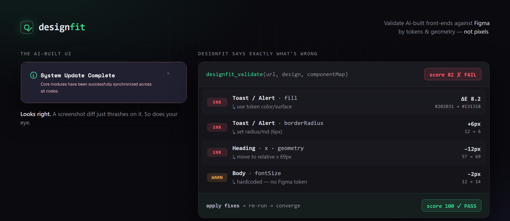

# designfit



**Validate AI-built front-ends against their Figma design — without the screenshot-diff thrash.**

▶ **[Watch the demo](https://github.com/as9978/designfit/releases/tag/v0.1.0)** — the fidelity loop closing in real time: Figma and the build side by side, score climbing to `pass`, no screenshot diffing anywhere in it.

`designfit` is an MCP server + Claude Code skill that checks a rendered implementation against its Figma design and hands the coding agent a machine-actionable fix-list. It compares **design tokens** and **geometry** (element boxes relative to the screen root) — not raw pixels — so font-rendering noise never makes the agent oscillate. Deterministic in, deterministic out.

[](https://github.com/as9978/designfit/actions/workflows/ci.yml)

## Why geometry, not pixels

Screenshot-diffing an AI-built UI against a Figma frame thrashes: anti-aliasing and sub-pixel shifts read as "still wrong," so the agent fixes forever. designfit compares what a designer actually catches — wrong colors, wrong sizes, misalignment, missing elements — as **deterministic measurements with explicit tolerances**. Same input, same output, no oscillation.

## Install

**Claude Code — as a plugin:**

```
/plugin marketplace add as9978/designfit
/plugin install designfit@designfit
```

Then once, to fetch the browser the measurement engine drives:

```bash
npx playwright install chromium
```

The plugin registers the `designfit_validate` MCP server and the `designfit-fidelity-loop` skill together — nothing to configure, nothing to copy by hand.

**Any other MCP client — manually:**

```bash
npm install -g designfit
npx playwright install chromium
```

```json
{ "mcpServers": { "designfit": { "command": "designfit" } } }
```

> **Windows:** some MCP clients can't spawn a bare `designfit` (it resolves to `designfit.cmd`). Use `{ "command": "npx", "args": ["-y", "designfit"] }`, or point at the binary directly with `{ "command": "node", "args": ["<absolute-path>/node_modules/designfit/dist/index.js"] }`. The plugin install above already uses the `npx` form, so it isn't affected.

## Use

Connect Figma's MCP too, then ask your agent to implement a frame. The `designfit-fidelity-loop` skill drives: build → tag elements with `data-designfit-id` → `designfit_validate` → fix → repeat until `pass`.

If you installed the plugin, the skill is already registered. On a manual install it isn't: skills aren't auto-loaded from an npm dependency, so copy the one that ships at `skill/SKILL.md` into your agent's skills directory (for Claude Code: `.claude/skills/designfit-fidelity-loop/SKILL.md`) so it can be discovered.

The one tool, `designfit_validate`, takes `{ url, viewport, design, componentMap, tolerances? }` and returns `{ pass, score, violations, unmapped }`.

For a full walkthrough on a real Figma frame — the loop, a copy-paste prompt, and troubleshooting — see [docs/validating-a-figma-frame.md](docs/validating-a-figma-frame.md).

## v1 scope

One viewport. Token + geometry + presence checks. Responsive multi-breakpoint and a perceptual VLM fallback are on the roadmap, not in v1.

## License

MIT
